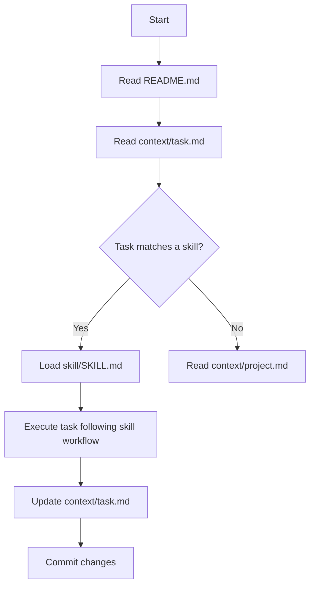

# EjeClick — AI Agent Context

**Read this first.** This file is the universal entry point for any AI agent or engineer working on this project.

## Project Overview

Landing page de alta conversión para **EjeClick** (agencia de desarrollo web para microempresas). Construida bajo estándares Silicon Valley: React 19 + Vite 8 + Three.js + FastAPI + PostgreSQL + Docker.

**Estado:** ~95% completo. Ver `context/task.md` para backlog detallado.

---

## Entry Points

| File | Purpose | Required reading |
|---|---|---|
| `context/mission.md` | Product vision, Scrum methodology, Atomic Design rules | Always |
| `context/project.md` | Single Source of Truth: tech stack, conversion rules (AIDCA model) | Always |
| `context/task.md` | Scrum backlog with 100% current completion status | Always |

---

## Skills (Auto-loading)

Each skill is a `SKILL.md` file inside its own directory under `skills/<name>/`. **Load the matching skill before starting any task:**

| When the task is about... | Load skill |
|---|---|
| React components, UI, animations, 3D, Atomic Design, Tailwind | `skills/react-expert/SKILL.md` |
| FastAPI endpoints, SQLAlchemy models, Pydantic schemas | `skills/fastapi-expert/SKILL.md` |
| PostgreSQL schema, indexes, migrations, query optimization | `skills/dba-expert/SKILL.md` |
| CSP, CORS, rate limiting, security audit, pre-deploy checklist | `skills/security-expert/SKILL.md` |
| Vitest, React Testing Library, test patterns, coverage | `skills/testing-expert/SKILL.md` |
| Docker, CI/CD, nginx, SSL, deploy, monitoring | `skills/devops-expert/SKILL.md` |
| SEO, CRO, JSON-LD, Lighthouse, analytics, A/B testing | `skills/seo-cro-expert/SKILL.md` |

**Workflow for any AI agent:**


---

## Quick Commands

```bash
npm run dev              # Frontend dev server (Vite)
npm run build            # Production build (tsc + Vite)
npm test                 # Run all tests (Vitest)
npm run lint             # ESLint
npm run typecheck        # TypeScript check
docker compose up -d     # Full stack (frontend + backend + PostgreSQL)
```

---

## Git

Branch default: `main` — 7 commits, clean history. Husky pre-commit: lints staged files.

```bash
git log --oneline  # View commit history
```
