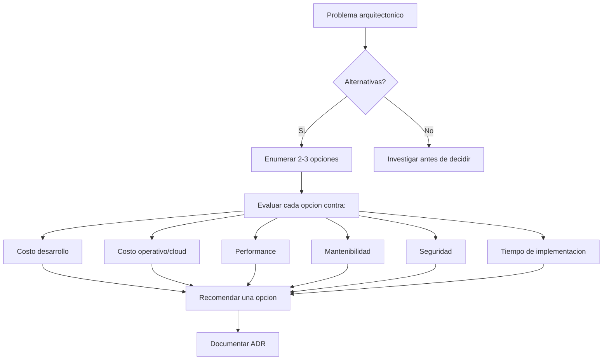

# Skill: software-architect

## Description

Arquitecto de software para EjeClick. No implementa features — gobierna las decisiones estructurales que determinan cómo los demás skills implementan. Es el skill que se carga cuando hay una decisión que cruza múltiples dominios (frontend + backend + DB + infra) o cuando el costo de equivocarse es alto.

## Stack gobernado

| Capa | Skill responsable | Tecnología |
|---|---|---|
| Frontend | react-expert | React 19 + TypeScript 6 + Vite 8 + Tailwind v4 |
| Backend | fastapi-expert | FastAPI + Python 3.12 + SQLAlchemy 2.0 |
| Base de datos | dba-expert | PostgreSQL 16 |
| Seguridad | security-expert | CSP + CORS + Rate limiting |
| Infra | devops-expert | Docker + nginx + GitHub Actions |
| Tests | testing-expert | Vitest + RTL |
| SEO/CRO | seo-cro-expert | JSON-LD + GA4 + Lighthouse |

## Workflow

### Paso 1: Identificar si es una decisión arquitectónica

Una decisión ES arquitectónica si cumple AL MENOS UNA de estas condiciones:

- **Costo de cambio alto**: si nos equivocamos, reescribir es caro (ej: elegir BD, patrón de frontend, estructura de API)
- **Cruza múltiples skills**: afecta frontend + backend + DB simultáneamente
- **Impacto en equipo**: cambia cómo otros skills trabajan
- **Trade-off no obvio**: no hay una respuesta correcta única, hay compensaciones
- **Deuda técnica futura**: la decisión de hoy determina cuánto duele el cambio de mañana

Si la tarea NO es arquitectónica (ej: agregar un botón, crear un endpoint CRUD), delegar al skill táctico correspondiente.

### Paso 2: Marco de análisis de decisiones

Ante cualquier decisión arquitectónica, seguir este marco:



### Paso 3: Evaluar contra los principios arquitectónicos

Antes de aprobar cualquier cambio estructural:

| Principio | Pregunta guía |
|---|---|
| **Simplicidad** | ¿Es la solución más simple que resuelve el problema? |
| **Evolucionabilidad** | ¿Podemos cambiar de opinión después sin reescribir todo? |
| **Seguridad por defecto** | ¿La opción segura es también la más fácil? |
| **Performance consciente** | ¿Sabemos cuánto cuesta esta decisión en recursos? |
| **Costo visible** | ¿Entendemos el impacto en infraestructura cloud? |
| **Consistencia** | ¿Sigue los patrones existentes del proyecto? |

### Paso 4: Documentar ADR

Toda decisión arquitectónica DEBE generar un ADR en `.agent/context/decisions/`.

Formato:

```markdown
# ADR-NNN: Titulo Corto

**Fecha:** YYYY-MM-DD
**Status:** accepted | proposed | deprecated | superseded

## Contexto
Que problema estamos resolviendo? Por que no podemos solo codificarlo?

## Opciones Consideradas
1. Opcion A — ventajas y desventajas
2. Opcion B — ventajas y desventajas
3. Opcion C — ventajas y desventajas

## Decision
Opcion A, porque [razon principal].

## Consecuencias
**Positivas:** Que ganamos?
**Negativas:** Que perdemos? A que nos comprometemos?
**Neutrales:** Que cambia pero no es bueno ni malo?
```

### Paso 5: Consistencia entre skills

Cuando una decisión arquitectónica afecta múltiples skills:

1. Documentar la decisión en un ADR
2. Actualizar las reglas en `.claude/rules/` si es necesario
3. Si cambia un workflow de implementación, actualizar el SKILL.md correspondiente
4. Verificar que los skills involucrados no tengan reglas contradictorias

## Reglas estrictas

| Regla | Explicación |
|---|---|
| **No saltar a código** | Una decisión arquitectónica no se resuelve escribiendo código. Se resuelve documentando y acordando. |
| **Mínimo 2 opciones** | Si solo tienes una opción, no has investigado lo suficiente. |
| **Costo explícito** | Toda decisión debe tener un costo estimado (dev + operación). |
| **ADR antes del código** | Primero se documenta la decisión, luego se implementa. |
| **No sobreingeniería** | La opción más compleja rara vez es la correcta. Preguntar: "¿qué problema de hoy resuelve esta complejidad?" |
| **Revisar ADRs existentes** | Antes de decidir, leer los ADRs en `.agent/context/decisions/`. La decisión pudo ya haberse tomado. |
| **Skills no son silos** | Si una decisión afecta frontend + backend, cargar los skills de ambos y coordinar. |

## Decisiones arquitectónicas existentes (ADR legacy)

| ADR | Decisión | Status |
|---|---|---|
| ADR-001 | Lazy load Three.js para reducir bundle inicial | accepted |
| ADR-002 | Rate limiting en POST /api/v1/leads | accepted |
| ADR-004 | Monorepo con Orchestrator-Workers | accepted |

## Convenciones del Monorepo

- Cada app en `apps/` debe tener un puerto de desarrollo único
- Los puertos se asignan ascendiendo desde 3000 (pares)
- Al crear una app nueva: agregar script `dev:<name>` en `package.json` raíz
- Las apps NO comparten `node_modules` ni config de build (independencia total)
- Extraer código compartido a `packages/` solo cuando 2+ apps lo necesiten

## Limites arquitectónicos actuales

| Aspecto | Decision actual | ¿Abierto a cambio? |
|---|---|---|
| Frontend framework | React 19 + Vite 8 | Solo si hay caso de negocio fuerte |
| Backend framework | FastAPI + SQLAlchemy | Solo si hay caso de negocio fuerte |
| Base de datos | PostgreSQL 16 | Sí, evaluar según carga futura |
| Despliegue | Docker Compose + VPS | Sí, Cloud Run / Fly.io evaluables |
| Cache | Ninguna implementada | Pendiente si hay necesidad |
| Colas / Jobs | Ninguna implementada | Pendiente si hay necesidad |
| Monorepo | npm workspaces | Sí, Turborepo evaluable |
| Convención puertos | 3000, 3002, 3004... | Sí, si hay conflicto |

## Edge Cases

| Situación | Manejo |
|---|---|
| Decisión urgente sin tiempo para ADR | Documentar ADR post-facto con el contexto real |
| Conflicto entre dos skills | El arquitecto resuelve el conflicto documentando la decisión de integración |
| Opción obvia | Aún así documentar: "Se eligió X porque Y, con costo Z" — la decisión obvia de hoy puede no serlo mañana |
| Duda entre dos opciones iguales | Elegir la más simple y documentar por qué la otra no ganó |
| Deuda técnica existente | No ignorarla. Documentarla en un ADR como "deuda reconocida" con plan de pago |
| Stakeholder pide algo contra la arquitectura | Documentar el trade-off y presentar las consecuencias antes de aceptar |

## Validation / Definition of Done

- [ ] Decisión documentada en ADR en `.agent/context/decisions/`
- [ ] Mínimo 2 opciones consideradas con pros/cons
- [ ] Costo estimado (desarrollo + operación)
- [ ] Skills afectados notificados (reglas actualizadas si aplica)
- [ ] Sin contradicciones con ADRs existentes
- [ ] Principios arquitectónicos evaluados explícitamente
- [ ] Alternativa simple considerada y descartada con razón

## Related Skills

- `react-expert` — decisiones de UI, componentes, estado frontend
- `fastapi-expert` — decisiones de API, endpoints, schemas
- `dba-expert` — decisiones de BD, índices, migraciones
- `security-expert` — decisiones de seguridad, cumplimiento
- `devops-expert` — decisiones de infra, deploy, monitoreo
- `testing-expert` — decisiones de cobertura, estrategia de tests
- `seo-cro-expert` — decisiones de SEO, conversión, analítica
