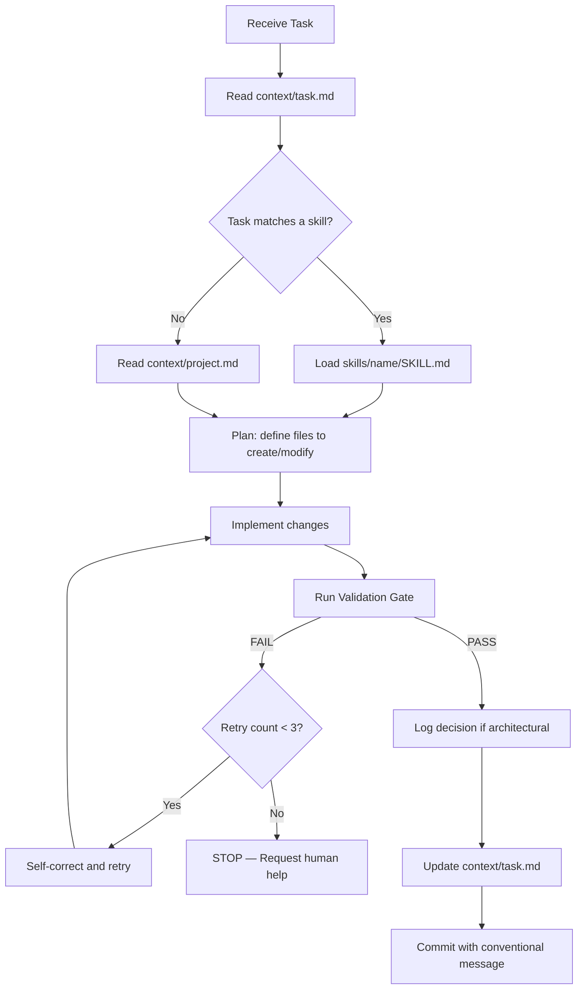

# AGENTS.md — Autonomous Execution Protocol

This document defines the rules, guardrails, and boundaries that **any AI agent** must follow when operating on this repository. It is the single source of truth for agent autonomy.

---

## 1. Agent Loop (Execution Cycle)

Every task must follow this deterministic loop. No shortcuts.



---

## 2. Validation Gate

Before marking **any** task as complete, the agent **must** run all of the following commands and verify they pass:

```bash
# All four must exit with code 0
npm run typecheck    # TypeScript strict — 0 errors
npm run lint         # ESLint — 0 errors
npm test             # Vitest — all tests pass
npm run build        # Vite production build — success
```

### Rules

- If **any** command fails, the agent must read the error output, fix the issue, and re-run.
- The agent has a maximum of **3 retry attempts** per validation failure.
- After 3 failed attempts on the same error, the agent **must stop** and report the issue to the human with:
  - The exact error message
  - What was attempted
  - A proposed next step

### Backend Validation (when modifying `backend/`)

```bash
cd backend
python -m pytest          # All tests pass
python -m mypy app/       # Type checking (if configured)
```

---

## 3. Self-Correction Rules

When a validation fails, the agent must follow this priority order:

1. **Read the error message carefully.** Most errors contain the file path and line number.
2. **Check if the error is in code the agent just wrote.** Fix it directly.
3. **Check if the error is a pre-existing issue.** Do not fix unrelated errors unless explicitly asked.
4. **Never suppress errors** by adding `// @ts-ignore`, `eslint-disable`, or `type: ignore` unless there is a documented, legitimate reason.
5. **Never delete tests** to make the suite pass.

---

## 4. Human-in-the-Loop Boundaries

### The agent HAS full autonomy to:

- Create, modify, or delete React components following Atomic Design
- Create, modify, or delete backend endpoints, models, and schemas
- Write and run tests
- Fix linting, type, and build errors
- Update documentation and context files
- Create new files in the established directory structure
- Run read-only database queries (`SELECT`)

### The agent MUST request human approval before:

| Action | Why |
|---|---|
| Installing/removing npm or pip dependencies | Cost, security, bundle size impact |
| Running destructive database operations (`DROP`, `DELETE`, `TRUNCATE`, `ALTER TABLE DROP COLUMN`) | Data loss risk |
| Modifying Docker infrastructure (`Dockerfile`, `docker-compose.yml`, `nginx.conf`) | Production stability |
| Changing CI/CD pipelines (`.github/workflows/`) | Deployment safety |
| Modifying environment variables or secrets (`.env`, `.env.example`) | Security |
| Changing authentication or authorization logic | Security |
| Making external HTTP requests to third-party APIs | Privacy, cost |
| Any action that could incur financial cost | Budget |

### When requesting approval:

```markdown
## 🔒 Human Approval Required

**Action:** [What the agent wants to do]
**Reason:** [Why it needs to do it]
**Risk:** [What could go wrong]
**Alternatives:** [Other options considered]
```

---

## 5. Decision Log (Architecture Decision Records)

When the agent makes a **non-trivial architectural decision**, it must log it in `.agent/context/decisions/`. This creates institutional memory.

### What qualifies as an architectural decision:

- Choosing one library/pattern over another
- Changing the data model or API contract
- Introducing a new convention or pattern
- Resolving a non-obvious bug with a workaround
- Performance optimizations with trade-offs

### ADR Format

File name: `NNN-short-title.md` (e.g., `001-lazy-load-threejs.md`)

```markdown
# ADR-NNN: Short Title

**Date:** YYYY-MM-DD
**Status:** accepted | superseded | deprecated

## Context
What is the issue or decision we need to make?

## Decision
What did we decide and why?

## Consequences
What are the trade-offs? What becomes easier/harder?
```

---

## 6. Context Management

### Before starting any task:

1. Read `context/task.md` — know the current state of the backlog
2. Read `context/project.md` — understand the technical constraints
3. Check `context/decisions/` — learn from past architectural choices

### After completing any task:

1. Update `context/task.md` — mark the story as `[x]` done
2. If you made an architectural decision, create an ADR in `context/decisions/`
3. If you discovered a bug or gotcha, document it in the relevant skill's `SKILL.md` under "Edge Cases"

### Context file ownership:

| File | Updated by | When |
|---|---|---|
| `context/mission.md` | Human only | Product vision changes |
| `context/project.md` | Human or Agent | Tech stack changes (with approval) |
| `context/task.md` | Agent | After completing each task |
| `context/decisions/*.md` | Agent | After architectural decisions |

---

## 7. Communication Standards

### When reporting progress:

- Be specific: "Created `ServiceCard` molecule with 4 props" not "Made the component"
- Include metrics: "Build size reduced from 1.2MB to 890KB"
- Link to files: Reference exact paths

### When reporting errors:

- Include the full error message
- Include what was tried
- Include a proposed solution

### When asking for clarification:

- State what you understand
- State what is ambiguous
- Propose a default and ask for confirmation

---

## 8. Security Rules

- Never commit secrets, API keys, or credentials to the repository
- Never log sensitive user data (emails, passwords, tokens)
- Always sanitize user input before database operations (handled by Pydantic/SQLAlchemy)
- Always use parameterized queries (handled by SQLAlchemy ORM)
- Never disable CORS, CSP, or rate limiting without human approval
